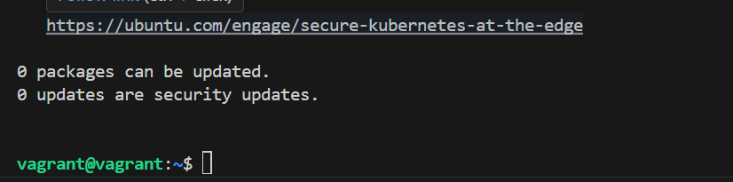
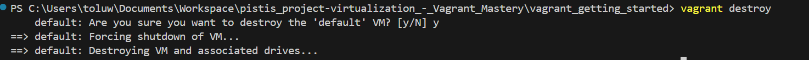

# Install and configure Vagrant on your Operating system.
1. I downloaded Vagrant using the official Vagrant [website](https://www.vagrantup.com/) and download edthe latest stable version for Windows.
2. I ran the installer by double-clicking the downloaded installer file and follow the on-screen instructions.
3. I verified installation by running `vagrant` in the terminal. 

**Create a directory:**
```
 mkdir vagrant_getting_started
```
**Move into your new directory.**
```
cd vagrant_getting_started
```
**Initialize the project**
```
vagrant init
```

**Use a Box**
```
Vagrant.configure("2") do |config|
  config.vm.box = "hashicorp/bionic64"
end
```

**Bring up a virtual machine**
```
 vagrant up
 ```
 

**SSH into the virtual machine:**
```vagrant ssh```


**Stop and Destroy the Vagrant Virtual Machine:**

To stop the virtual machine
```vagrant halt```

To completely destroy the virtual machine, freeing up resources:
```vagrant destroy```
